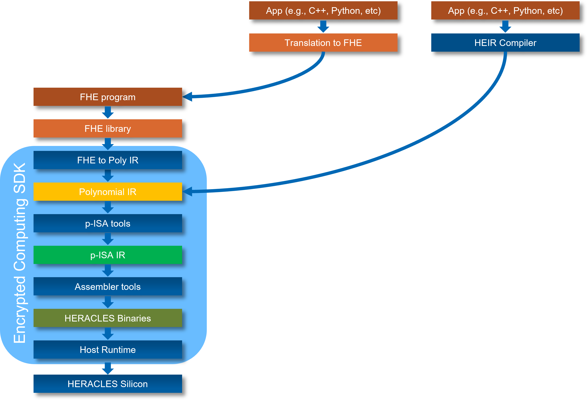
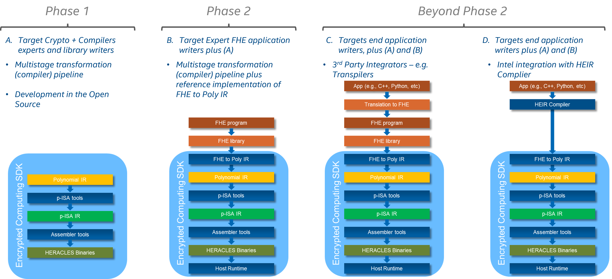
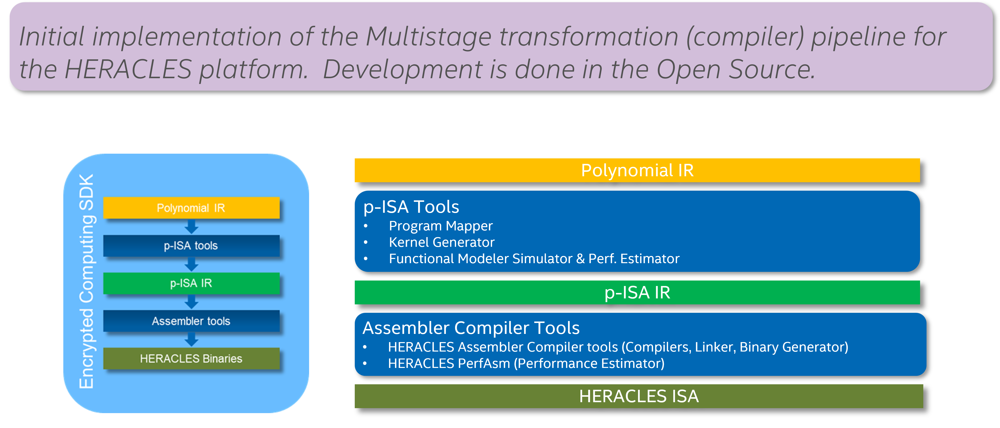

# Encrypted Computing Software Development Kit
[](https://github.com/IntelLabs/encrypted-computing-sdk/actions/workflows/codeql-analysis.yml)
[](https://scorecard.dev/viewer/?uri=github.com/IntelLabs/encrypted-computing-sdk)
[](https://www.bestpractices.dev/projects/9276)

## Overview
[Fully Homomorphic Encryption (FHE)](https://en.wikipedia.org/wiki/Homomorphic_encryption)
allows computation to be performed on encrypted data without having to decrypt
the data which brings in profound and beneficial implications for data privacy
and data confidentiality. However, these benefits come with a significant performance
cost which has so far confined FHE based applications to specific use case archetypes
primarily in use by the regulated industries and government.

Most of the FHE schemes of today perform the computation using very large
polynomial rings, thus requiring considerable compute power and data
movement between main memory and the CPU's registers, which introduces large
computational overheds. New FHE hardware accelerator architectures aim at
accelerate the computation over large polynomial rings while minimizing
the data movement between the memory and the compute elements.

The Encrypted Computing SDK introduces a multistage transformation
(compiler) pipeline that breaks down the large polynomial computation into
the various abstraction layers to make it easier for developers to target
different hardware architectures as well as to develop new implementations
of FHE schemes, and integrate with existing 3rd Party libraries, compilers
and transpilers. The SDK is inspired by the
[LLVM Compiler Infrastructure](https://llvm.org/), and adopts a
modular approach based on language independent intermediate
representations (IRs) that promotes the separation of concerns at each
stage of the pipeline and allowing for dedicated transformations and
optimizations.

Our first target hardware platform is Intel’s 
[HERACLES accelerator technology](https://dl.acm.org/doi/10.1145/3560810.3565290)
which introduces a new Polynomial Data type which does not exist in today's
traditional CPUs. For this new polynomial data type, it supports a
new set of novel and fundamental instructions, the Polynomial Instructions
Set Architecture (P-ISA), that operates directly on large polynomials in
a SIMD fashion. 


<p>


<br clear="left">
<br/>
<br/>
</p>

## Encrypted Computing SDK Roadmap: Phased Approach
<p>

<br/>
<br/>
<br/>
</p>

### Encrypted Computing SDK Phase 1: Components and Tasks
<p>

<br>
<br/>
<br/>
</p>

We are currently at Phase 1, developing the P-ISA tools and Assembler tools
component which comprises a) Kernel Generator, b) Program
Mapper, c) Functional Modeler Simulator, and d) HERACLES Assembler.
Each tool in this repo is self contained and has its own local README.

# Contributing
Intel P-ISA Tools project welcomes external contributions through pull
requests to the `main` branch.

Please refer to the [Contributing](CONTRIBUTING.md) and
[Code of Conduct](CODE_OF_CONDUCT.md) documents for additional information on
the contribution acceptance guidelines.

We use signed commits, please remember to sign your commits before making a
pull request.  See instructions
[here](https://docs.github.com/en/github/authenticating-to-github/managing-commit-signature-verification/signing-commits)
for how to sign commits.

We also use `pre-commit`, so before contributing, please ensure that you run
[pre-commit](https://pre-commit.com) and make sure all checks pass with
```bash
pre-commit install
pre-commit run --all-files
```

Please run the tests provided in each of the components and make sure
the tests pass.

# Feedback
We encourage feedback and suggestions via
[GitHub Issues](https://github.com/IntelLabs/encrypted-computing-sdk/issues) as well
as via
[GitHub Discussions](https://github.com/IntelLabs/encrypted-computing-sdk/discussions).
