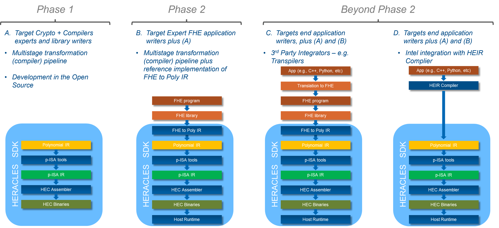
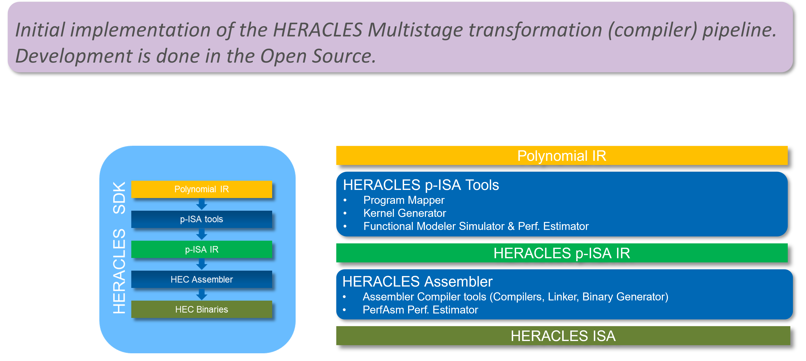

# HERACLES P-ISA Tools
## Overview
Intel’s [HERACLES accelerator technology](https://dl.acm.org/doi/10.1145/3560810.3565290) aims at improving the computational performance of [Fully Homomorphic Encryption (FHE)](https://en.wikipedia.org/wiki/Homomorphic_encryption).
FHE is a form of encryption that allows computation to be performed on encrypted data without having to decrypt the data, which brings in profound and beneficial implications for data privacy and data confidentiality. But these benefits come with a significant performance cost, which has so far confined FHE based application to specifc use case archetypes primarely in use by the regulated industries and governemnt.

Most of the FHE schemes of today perform the computation of very large polynomial rings, thus requiring considerable compute power and data movement between main memory and the CPU's registers. HERACLES improves the performance of FHE by accelerating the computation over the large polynomials and optimizing the data movement involved in the computation.

HERACLES introduces a new Polynomial Data type which does not exist in today's traditional CPUs. For this new polynomial data type, it supports a new set of novel and fundamental instructions, the Polynomial Instructions Set Architecture (P-ISA), that operates directly on large polynomials in a SIMD fashion. We at Intel Labs are developing a new compiler pipeline, the Encrypted Computing SDK, to make it easier for developers to develop new implementations of FHE schemes and also integrate with existing libraries.

  
The Encrypted Computing SDK (or HERACLES SDK) will realze a multistage transformation (compiler) pipeline, inspired by the [LLVM Compiler Infrastructure](https://llvm.org/). We have adopted a modular approach based on language independednt intermediate representations (IR) that promotes the separation of concerns at each stage of the pipeline and allowing for dedicated tranformations and optimizations.

This approach also allows for integration with 3rd Party compilers and transpilers.
 
 
 

## HERACLES SDK Roadmap: Phased Approach

 
 
 

### HERACLES SDK Phase 1: Components and Tasks

 
 
 

We are currently at Phase 1, more specifically developing the P-ISA Tools component which comprises three main tools, a) Kernel Generator, b) Program Mapper, and c) Functional Modeler Simulator. Each tool in this repo is self contained and has its own local README.

Currently our development is focussed on the [Kernel Generator](./kerngen). Follow the instructions to start experimenting with it.

